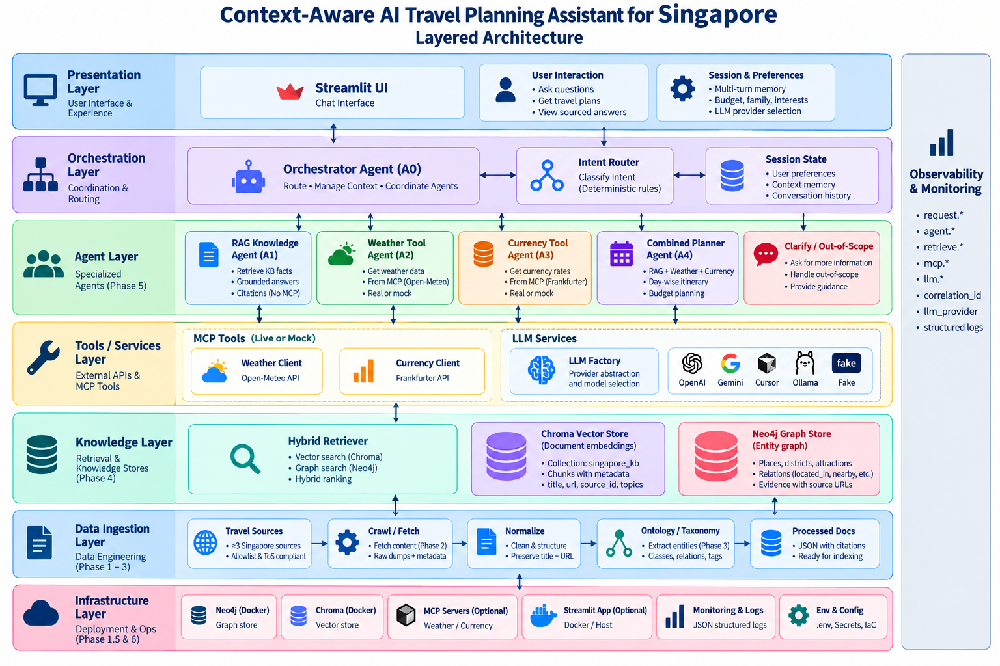

# AI Travel Planning Assistant (Singapore)

**Public repository:** [https://github.com/satyendranagarro/Assignment_AIML](https://github.com/satyendranagarro/Assignment_AIML)

A context-aware travel assistant for **Singapore**. It combines a document knowledge base (RAG) with current weather and currency from MCP tools, then combines both when a question needs destination knowledge and live data — for example: *“Plan a three-day trip to Singapore and adjust the activities based on the weather forecast.”*

Assignment brief: [`Requirement/AI_Travel_Planning_Assistant_Assignment.pdf`](Requirement/AI_Travel_Planning_Assistant_Assignment.pdf)

**What it does**

- **Destination knowledge (RAG)** — attractions, neighbourhoods, transport, culture, food, indoor/outdoor tips, sample itineraries; grounded answers with source title + URL
- **Current information (MCP)** — weather (Open-Meteo) and currency conversion (Frankfurter); MCP results are labeled; failures never invent temps or FX rates
- **Combined answers** — weather-aware / budget-aware itineraries using RAG + MCP + LLM suggestions, each clearly distinguished
- **Multi-turn context** — session remembers preferences (family, budget, indoor/outdoor) across turns
- **Intent routing** — orchestrator picks RAG, weather, currency, combined, clarify, or out-of-scope
- **Streamlit UI** — simple chat UI with toggleable LLM (OpenAI, Gemini, Cursor, Ollama)

Out of scope: flight/hotel booking, payments, navigation, reservations.

**Stack:** LangChain · embeddings + vector store (Chroma) · Neo4j graph · MCP clients · Streamlit

---

## Architecture

The system is a modular multi-agent stack: Streamlit for chat, an orchestrator that routes intent, specialist agents for RAG / weather / currency / combined planning, hybrid retrieval over Chroma + Neo4j, MCP-style live tools, and a provider-agnostic LLM factory. Answers are labeled so you can see what came from the knowledge base, live tools, or the model.

### Layered system architecture



| Layer | Role |
|-------|------|
| **Presentation** | Streamlit chat UI, multi-turn session, preferences (budget, family, interests), LLM provider toggle |
| **Orchestration** | Orchestrator (A0) + deterministic intent router + session state |
| **Agents** | A1 RAG · A2 weather · A3 currency · A4 combined planner · clarify / out-of-scope |
| **Tools / services** | Weather MCP (Open-Meteo) · Currency MCP (Frankfurter) · LLM factory (OpenAI, Gemini, Cursor, Ollama, fake) |
| **Knowledge** | Hybrid retriever over Chroma (`singapore_kb` chunks) and Neo4j (places, districts, relations + evidence URLs) |
| **Data ingestion** | Sources → crawl → normalize → ontology → processed docs ready to index |
| **Infrastructure** | Docker Neo4j / Chroma, optional MCP and Streamlit containers, `.env` config, JSON observability logs |

Observability runs across layers (requests, agents, retrieval, MCP, LLM) with correlation IDs and structured JSON logs.

### Agent run flow (question → labeled answer)


1. User asks a question in Streamlit (session holds preferences and history).
2. **A0** classifies intent with a deterministic router and dispatches:
   - **A1 (RAG)** — HybridRetriever (Chroma vector + Neo4j graph) → grounded answer with citations
   - **A2 (Weather)** — MCP → Open-Meteo (live or mock)
   - **A3 (Currency)** — MCP → Frankfurter (live or mock), can use session budget
   - **A4 (Combined)** — coordinates A1 + A2 + A3 for day-wise itinerary / budget synthesis
   - **Clarify / out-of-scope** — ask for missing details or refuse unsupported asks (e.g. booking)
3. Agents call the **LLM factory** when phrasing or planning is needed.
4. Response blocks are labeled for the UI:

| Label | Meaning |
|-------|---------|
| `[KB fact]` | Grounded knowledge with source title + URL |
| `[MCP data]` | Live weather or FX from tools |
| `[LLM suggestion]` | Model synthesis (e.g. itinerary wording) |
| `[Error]` | Tool / config / retrieval failure (no fabricated data) |
| `[System]` | Guidance, clarify, or out-of-scope messages |

### Knowledge creation pipeline


| Stage | What happens |
|-------|----------------|
| **Travel sources** | ≥3 public Singapore resources (see below); manual markdown fallback if crawl is blocked |
| **Ingestion** | Allowlisted crawl with rate limits / robots.txt → raw HTML/MD + title, URL, `fetched_at` |
| **Normalize** | Strip noise, preserve citations, topic tags, chunk for embeddings |
| **Ontology** | Taxonomy (Attraction, District, …), entity extract/dedupe, entity graph with evidence snippets |
| **Stores** | **Chroma** — semantic search over chunk embeddings · **Neo4j** — graph retrieval (`located_in`, `nearby`, …) |

Artifacts: `data/sources.yaml`, `coverage_matrix.yaml`, processed JSON under `data/processed/`, `taxonomy.yaml`, `entities.json`. Agents use the **same** Chroma + Neo4j this pipeline loads.

---

## Knowledge-base sources

Registry: [`data/sources.yaml`](data/sources.yaml). Original **title + URL** are kept as metadata through crawl → chunk → retrieve for citations.

| Source | Coverage |
|--------|----------|
| [Wikivoyage Singapore](https://en.wikivoyage.org/wiki/Singapore) | Districts, attractions, transport, food, practical tips, itineraries |
| [Visit Singapore — Plan Your Trip / Essentials](https://www.visitsingapore.com/mice/en/tools-and-resources/plan-your-trip/) | Practical visitor info, climate, language, connectivity, services |
| [Visit Singapore — Sample Itineraries](https://www.visitsingapore.com/travel-tips/travelling-to-singapore/itineraries/7-days-in-singapore/) | Duration/profile itineraries |
| [Visit Singapore — Top Things to Do](https://www.visitsingapore.com/things-to-do/top-things-to-do/) | Attractions and activities by interest |

Follow each publisher’s reuse terms when redistributing extracted content. Manual curated dumps under `data/raw/` are used when automated fetch is blocked.

### RAG workflow

1. Load travel content from public pages / curated dumps  
2. Split into meaningful chunks with citation metadata  
3. Embed chunks and store in **Chroma** (`singapore_kb`)  
4. Load entities/relations into **Neo4j** for graph expansion  
5. On each question: hybrid retrieve → ground the LLM on excerpts only  
6. Show source title/link; if KB is thin, say so instead of inventing facts  

MCP is **not** used for destination facts already covered by the KB.

---

## MCP tools

| Tool | Backend | Example questions |
|------|---------|-------------------|
| **Weather** | Open-Meteo via MCP client | Forecast next 3 days; rain expected?; indoor vs outdoor tomorrow |
| **Currency** | Frankfurter via MCP client | Convert INR 50,000 to SGD; budget USD → SGD |

Requirements covered: connect ≥2 MCP tools, expose them to the app, select by intent, pass inputs, use results in the reply, label MCP data, and surface errors without fabricating answers. Agents default to **in-process** clients (same logic as `mcp_servers/`); Compose profiles can run MCP sidecars.

---

## Prompt and context strategy

Prompts live in [`src/prompts/templates.py`](src/prompts/templates.py) (XML-style role / instructions / constraints / context / task):

- **KB facts** — only from retrieved `<context>` excerpts; never invent attractions, hours, or prices  
- **MCP** — weather/currency appear in separate tagged blocks; treated as current data, not KB  
- **Honesty** — if excerpts are thin or tools fail, say so; no silent fallback to another LLM provider  
- **Structure** — clear chat-style recommendations; citations attached by the app as `[KB fact]`  
- **Labels** — UI distinguishes `[KB fact]`, `[MCP data]`, and `[LLM suggestion]`  
- **Session** — `<session_preferences>` carries family / budget / indoor-outdoor across turns  

Combined planner prompt asks for a day-wise plan, prefers indoor options on rainy days, and still forbids inventing places missing from excerpts.

---

## How to run

Requires **Python 3.10+** (3.12 recommended), Docker, and an API key for your chosen LLM provider.

### 1. Setup

```bash
cp .env.example .env
# Set OPENAI_API_KEY (or GOOGLE_API_KEY / CURSOR_API_KEY), LLM_PROVIDER, and NEO4J_PASSWORD

python3.12 -m venv .venv && source .venv/bin/activate
pip install -r requirements.txt
```

### 2. Start knowledge stores

```bash
export NEO4J_PASSWORD=changeme
docker compose -f infra/compose.yml up -d
```

### 3. Build and load the knowledge base

```bash
python scripts/crawl.py --force-manual
python scripts/normalize.py
python scripts/build_ontology.py

export CHROMA_HOST=localhost CHROMA_PORT=8000
python scripts/build_kb.py --embeddings openai --gate
python scripts/load_neo4j.py --require-neo4j
```

### 4. Start the app

```bash
streamlit run app/streamlit_app.py
```

Or with MCP sidecars and Streamlit in Docker:

```bash
docker compose -f infra/compose.yml --profile mcp --profile app up -d --build
# UI: http://localhost:8501
```

### Sample questions and demo

<video src="docs/demo/demo_aiml_480.mov" controls width="100%" title="AI Travel Planning Assistant demo"></video>

- Demo video: [`docs/demo/demo_aiml_480.mov`](docs/demo/demo_aiml_480.mov)  
- Sample Q&A shapes: [`docs/SAMPLE_QA.md`](docs/SAMPLE_QA.md)  
- Live demo checklist: [`docs/DEMO_CHECKLIST.md`](docs/DEMO_CHECKLIST.md)  

Try at least: RAG attractions, weather forecast, currency convert, **combined weather-aware 3-day itinerary**, and a multi-turn family preference turn.

---

## Minimum acceptance criteria

| Criterion | How this project meets it |
|-----------|---------------------------|
| KB from ≥3 travel resources | `data/sources.yaml` (Wikivoyage + Visit Singapore sources) |
| Embedding-based semantic retrieval | Chroma + HybridRetriever |
| Grounded answers with source references | `[KB fact]` + title/URL citations |
| Weather via MCP | Weather client / `mcp_servers/weather` → Open-Meteo |
| Currency via MCP | Currency client / `mcp_servers/currency` → Frankfurter |
| ≥1 combined RAG + MCP response | Combined planner (weather-aware itinerary) |
| Multi-turn retained context | SessionState in Streamlit |
| Intent-based tool selection | Orchestrator intent router |
| Missing KB / tool failures | Explicit `[Error]` / thin-KB messaging; no fabrication |
| Simple usable UI | `app/streamlit_app.py` |
