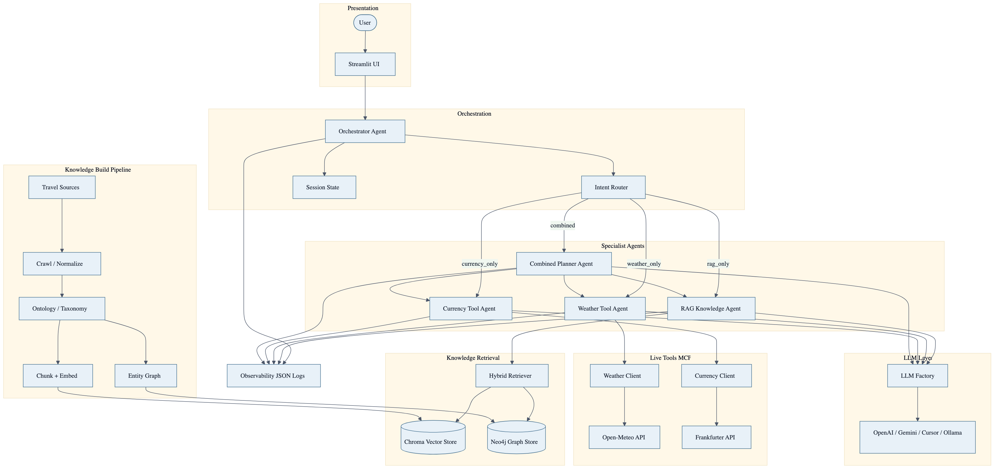
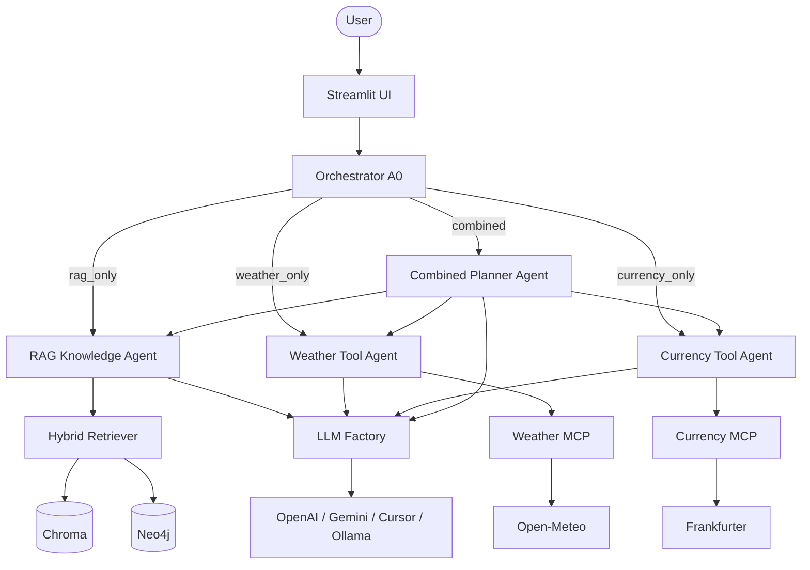

# AI Travel Planning Assistant (Singapore)

A context-aware travel assistant for **Singapore**. It answers questions using a grounded knowledge base, live weather and currency tools, and an LLM — then labels what came from where.

**What it does**

- **RAG** over a Singapore travel knowledge base (Chroma vector store + Neo4j graph)
- **Live tools** for weather (Open-Meteo) and currency (Frankfurter) via MCP-style clients
- **Combined planning** (e.g. weather-aware itineraries) by routing intent to specialist agents
- **Streamlit UI** with a toggleable LLM provider (OpenAI, Gemini, Cursor, or Ollama)

Out of scope: booking, payments, navigation, and reservations.

---

## Architecture





**Request path:** Streamlit → Orchestrator (intent router) → one of A1–A4 → retrieve and/or call live tools → LLM → labeled answer.

**Knowledge build:** crawl/normalize sources → ontology → chunk + embed into Chroma and load entities into Neo4j. Agents use the same stores the pipeline loads.

---

## How to run

Requires **Python 3.10+** (3.12 recommended) and an API key for your chosen LLM provider.

### 1. Setup

```bash
cp .env.example .env
# Set OPENAI_API_KEY (or GOOGLE_API_KEY / CURSOR_API_KEY) and LLM_PROVIDER

python3.12 -m venv .venv && source .venv/bin/activate
pip install -r requirements.txt
```

### 2. Build the knowledge base (offline / local files)

```bash
python scripts/crawl.py --force-manual
python scripts/normalize.py
python scripts/build_ontology.py
python scripts/build_kb.py --embeddings openai --gate
python scripts/load_neo4j.py --memory
```

### 3. Start the app

```bash
streamlit run app/streamlit_app.py
```

### Optional: full stack with Docker

```bash
export NEO4J_PASSWORD=changeme
docker compose -f infra/compose.yml up -d

export CHROMA_HOST=localhost CHROMA_PORT=8000
python scripts/build_kb.py --embeddings openai --gate
python scripts/load_neo4j.py --require-neo4j

streamlit run app/streamlit_app.py
# Or: docker compose -f infra/compose.yml --profile mcp --profile app up -d --build
# UI: http://localhost:8501
```

### Offline demo (no live APIs)

```bash
export LLM_PROVIDER=fake EMBEDDING_PROVIDER=fake MCP_MOCK_MODE=true
streamlit run app/streamlit_app.py
```
