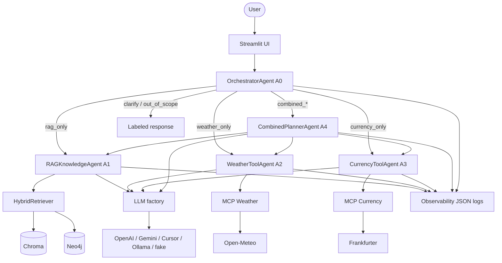
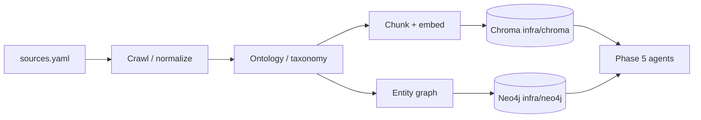
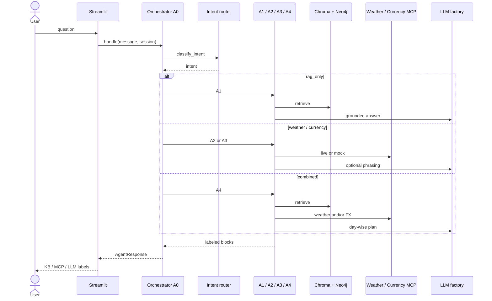

# Architecture overview — Phase 0

## Purpose

Context-aware **AI Travel Planning Assistant** for **Singapore** that combines:

1. A **document knowledge base** (RAG over Chroma, optional Neo4j expansion)
2. **Current information** via **MCP** (weather + currency)
3. **Combined** answers (e.g. weather-aware three-day itinerary)

Source of truth for product requirements: [`Requirement/AI_Travel_Planning_Assistant_Assignment.pdf`](../../Requirement/AI_Travel_Planning_Assistant_Assignment.pdf).

## System context

### Runtime (query path)

### Knowledge build (Phases 1–4)

### Agent routing sequence

## Stack A (locked)

| Layer | Technology |
|-------|------------|
| Orchestration | LangChain |
| LLM (toggle) | OpenAI · Gemini · Cursor (OpenAI-compatible) |
| Embeddings | Via `EMBEDDING_PROVIDER` (default = chat provider) |
| Vector DB | Chroma (via Phase 1.5 `infra/chroma/`) |
| Graph DB | Neo4j (via Phase 1.5 `infra/neo4j/`) |
| UI | Streamlit (sidebar LLM toggle) |
| Tools | MCP weather, MCP currency |
| Observability | Generic JSON structured logs |

See [`DECISIONS.md`](../../DECISIONS.md) and [`.env.example`](../../.env.example).

### LLM toggle

`LLM_PROVIDER=openai|gemini|cursor|ollama|fake` plus Streamlit sidebar override. Factory: `src/llm/factory.py` delegates to `LLMProviderAdapter` implementations under `src/llm/adapters/` (switch via registry). No silent fallback if the selected provider’s key is missing.

### Observability

`src/observability` emits `request.*`, `agent.*`, `retrieve.*`, `mcp.*`, `llm.*` with `correlation_id` / `llm_provider`. Config: `LOG_LEVEL`, `LOG_FORMAT`, `LOG_FILE`.

## Phase gate summary

| Phase | Deliverable | Gate |
|-------|-------------|------|
| 0 | Skill, scaffold, this overview, USE_CASES skeleton | Present before Phase 1 |
| 1 | Ingest/normalize + coverage matrix | ≥3 sources with citations metadata |
| **1.5** | **Knowledge IaC** (`infra/neo4j`, `infra/chroma`) | Stores healthy; env contract documented |
| 2 | Allowlisted crawl | Topic coverage green |
| 3 | Ontology + taxonomy | Validated entities |
| 4 | Load KB **into** Phase 1.5 infra + retriever | Live retrieval smoke (offline fallback OK for CI) |
| 5 | Agents + MCP + UI + UC runs (**same** KB infra) | Use-case pass bar |
| 6 | README, samples, demo, MCP/app IaC + umbrella | Assignment deliverables 15–20 |

Decision tables that choose the *shape* of the next phase live in the project skill and in each phase architecture doc.

## Agents (preview)

| ID | Name | Responsibility |
|----|------|----------------|
| A0 | OrchestratorAgent | Intent routing + conversation state |
| A1 | RAGKnowledgeAgent | Grounded destination Q&A + citations |
| A2 | WeatherToolAgent | Forecast/current via MCP |
| A3 | CurrencyToolAgent | FX conversion via MCP |
| A4 | CombinedPlannerAgent | Day-wise plans merging RAG + MCP |

Full behavior and sequence diagrams: `05-agents.md` (Phase 5).

## Out of scope

Flight/hotel booking, payments, route navigation, reservations.

## Acceptance criteria (assignment)

- [x] KB from ≥3 travel resources
- [x] Embedding-based semantic retrieval
- [x] Grounded answers with source references
- [x] Weather via MCP
- [x] Currency via MCP
- [x] ≥1 combined RAG + MCP response
- [x] Multi-turn context retained
- [x] Intent-based tool selection
- [x] Clear handling of missing KB / tool failures
- [x] Simple usable UI

Mapped to use-case IDs in [`docs/USE_CASES.md`](../USE_CASES.md). Evidence: [`06-ops-and-acceptance.md`](06-ops-and-acceptance.md), [`DEMO_CHECKLIST.md`](../DEMO_CHECKLIST.md).

## Related docs

| Doc | Phase |
|-----|-------|
| `01-data-pipeline.md` | 1 |
| `01b-knowledge-infra.md` | **1.5** knowledge store IaC |
| `02-crawl.md` | 2 |
| `03-ontology.md` | 3 |
| `04-stores.md` | 4 (load into 1.5 infra) |
| `05-agents.md` | 5 |
| `06-ops-and-acceptance.md` | 6 (deliverables + MCP/app IaC) |

## Local infrastructure

**Knowledge (Phase 1.5)** — required for live pipeline/agent tests:

| Unit | Service |
|------|---------|
| `infra/neo4j/` | Graph DB (`NEO4J_*`) |
| `infra/chroma/` | Vector DB + volume |
| `infra/kb-pipeline/` (optional) | DE → load job |

**Runtime (Phase 6 — done):**

| Unit | Service |
|------|---------|
| `infra/mcp-weather/` | Weather MCP (`--profile mcp`) |
| `infra/mcp-currency/` | Currency MCP (`--profile mcp`) |
| `infra/app/` (optional) | Streamlit UI (`--profile app`) |

LLM providers stay `.env` only. Details: [`01b-knowledge-infra.md`](01b-knowledge-infra.md), [`06-ops-and-acceptance.md`](06-ops-and-acceptance.md).

## Phase status

- **Phase 0 — Complete.** Skill, scaffold, this overview, USE_CASES, README, DECISIONS, `.env.example`, `requirements.txt`, `.gitignore`.
- **Phase 1 — Complete.** See [`01-data-pipeline.md`](01-data-pipeline.md).
- **Phase 1.5 — Complete.** Knowledge Compose units; see [`01b-knowledge-infra.md`](01b-knowledge-infra.md).
- **Phase 2 — Complete.** See [`02-crawl.md`](02-crawl.md).
- **Phase 3 — Complete.** See [`03-ontology.md`](03-ontology.md).
- **Phase 4 — Complete.** See [`04-stores.md`](04-stores.md).
- **Phase 5 — Complete.** Agents A0–A4, MCP, Streamlit; see [`05-agents.md`](05-agents.md).
- **Phase 6 — Complete.** Deliverables + MCP/app umbrella; see [`06-ops-and-acceptance.md`](06-ops-and-acceptance.md), [`DEMO_CHECKLIST.md`](../DEMO_CHECKLIST.md), [`SAMPLE_QA.md`](../SAMPLE_QA.md).
